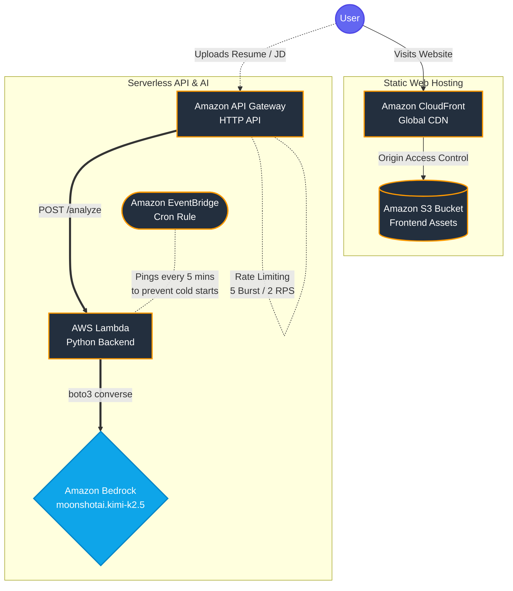

# AWS Bedrock ATS Analyzer

[](https://dlyw53evv28n0.cloudfront.net/)

A full-stack serverless application that acts as an Applicant Tracking System (ATS) analyzer. This project aims to seamlessly compare a candidate's resume (PDF) against a Job Description and dynamically provide an ATS match score, matching/missing keywords, and actionable feedback.

This project uses **Amazon Bedrock** (running the `moonshotai.kimi-k2.5` foundation model) alongside a Serverless AWS Infrastructure deployed entirely via the **AWS Cloud Development Kit (CDK)** in Python.

---

## 🏗️ Architecture

The infrastructure is entirely serverless, ensuring high scalability, zero maintenance, and a pay-as-you-go pricing model (with built-in AWS Free Tier optimizations).



### Components
1. **Frontend (S3 & CloudFront)**: A vanilla JS/HTML/TailwindCSS frontend using `pdf.js` to extract text client-side. Hosted securely in an S3 Bucket, cached and delivered globally via an Amazon CloudFront distribution.
2. **Backend (API Gateway & Lambda)**: An HTTP API with strict DDoS mitigation (rate limiting throttled at 2 RPS) routing to a Python 3.12 AWS Lambda function.
3. **AI Integration (Amazon Bedrock)**: The Lambda utilizes the new `boto3.client('bedrock-runtime').converse()` API, instructing an AI model to act as a strict Senior Technical Recruiter and output a JSON payload.
4. **Lambda Warmer (EventBridge)**: A free-tier cron job pings the Lambda every 5 minutes and immediately returns `200 OK` (bypassing the AI) to prevent AWS Lambda "Cold Start" user latency.

---

## 🚀 Deployment

The AWS infrastructure is defined natively using AWS CDK (v2) Python constructs. The single command deploys both the backend and frontend simultaneously.

### Prerequisites
- Node.js (for AWS CDK CLI)
- Python 3.12+
- Docker (for the `PythonFunction` construct if bundling dependencies)
- Boto3 / AWS CLI credentials configured

### Setup and Deploy

1. **Clone the repository and set up a Virtual Environment**:
   ```bash
   git clone <repo-url>
   cd aws-bedrock-ats-analyzer
   python3 -m venv .venv
   source .venv/bin/activate
   pip install -r requirements.txt
   ```

2. **Bootstrap the AWS Account** (if you haven't used CDK in this region):
   ```bash
   cdk bootstrap
   ```

3. **Deploy the full stack**:
   ```bash
   cdk deploy --context stage=prod
   ```
   > During deployment, CDK will provision the backend, spin up an edge network, bundle the local `frontend/` directory, and automatically upload the static assets into the newly created S3 Bucket.

4. **Verify Deployment**:
   After CDK synthesizes, look for the CloudFormation `Outputs` block in your terminal:
   - `AwsBedrockAtsAnalyzerStack-prod.CloudFrontDomain`: Navigate to this URL to view the live web interface.

---

## 🛡️ Security
This stack implements multiple layers of AWS best practices:
- **Least Privilege IAM**: The Lambda execution role is strictly scoped to `bedrock:InvokeModel` only for the declared foundation model ARN.
- **Origin Access Control (OAC)**: The S3 static website bucket explicitly denies all public access and enforces that files can only be read via the CloudFront distribution origin.
- **DDoS Mitigation**: API Gateway is configured with a strict `throttling_rate_limit` wrapper to protect against "Denial of Wallet" spam attacks targeting the AI endpoint. 
